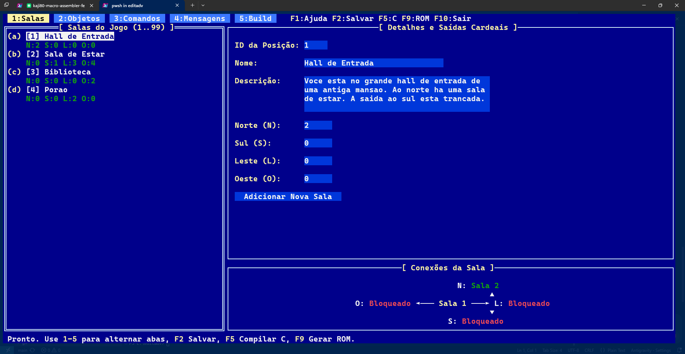

# 🏰 Editor de Adventures — MSX Clean-Room Edition

[](https://en.wikipedia.org/wiki/MSX)
[-green.svg)](https://github.com/Aoineko-MSX/MSXgl)
[](https://go.dev)
[](https://www.gnu.org/licenses/gpl-3.0)
[]()

> Uma reconstrução moderna e de engenharia reversa **Clean-Room** do clássico ecossistema de criação de jogos de aventura em texto para a linha de microcomputadores **MSX**, originalmente concebido pelo lendário desenvolvedor brasileiro **Renato Degiovani**.

<p align="center">
  
</p>

---

## 📜 Sobre o Projeto

Na década de 1980, o **"Editor de Adventures"** (também conhecido no ecossistema de fitas e disquetes como *T-Editor*) revolucionou o desenvolvimento nacional de jogos ao fornecer uma engine completa baseada em dados e uma máquina virtual de bytecode interpretada pelo processador Z80 no MSX. Com ele, autores podiam estruturar salas, inventários, sinônimos e regras de mundo sem precisar programar em Assembly diretamente.

Este projeto realiza a **modernização integral e Clean-Room** daquele sistema:
1. **Nenhum byte ou binário original foi desassemblado:** Toda a arquitetura foi reconstruída a partir das especificações conceituais e tabelas do manual original.
2. **Separação elegante em dois mundos:**
   - **O Compilador e Editor TUI (PC):** Escrito em **Go**, permitindo escrever histórias em arquivos legíveis modernos (**YAML** ou **JSON**), editar salas e conexões por um editor textual com mapa visual interativo no estilo *Turbo Vision*, e compilar as tabelas para matrizes estáticas em C.
   - **A Engine (MSX):** Escrita em **C moderno (C99)** para o compilador **SDCC**, utilizando a consagrada biblioteca **MSXgl**. Ela funciona como uma máquina virtual compacta e ultrarrápida que interpreta o bytecode e renderiza a interface autêntica no MSX.

---

## 🎖️ Créditos e Homenagem

Este projeto é dedicado com profundo respeito e admiração a **Renato Degiovani**, pioneiro absoluto da indústria de jogos eletrônicos no Brasil.

Autor de clássicos inesquecíveis como:
- *Aventuras no Mundo Antigo* (1983) — considerado o primeiro jogo de aventura brasileiro;
- *Amazônia* (1983) — o mais célebre adventure em texto nacional;
- *Serra Pelada* (1986);
- *Editor de Adventures / T-Editor* (1986).

A genialidade de Renato Degiovani ao conceber nos anos 80 uma **arquitetura orientada a dados com máquina virtual de bytecode, byte de consistência e divisão harmônica de tela** serviu como planta baixa e inspiração para esta reconstrução moderna.

---

## 🛠️ Tecnologias e Ferramentas Utilizadas

### No PC (Editor & Ferramentas de Autoria)
- **[Go (Golang)](https://go.dev):** Linguagem moderna, robusta e concorrente utilizada para o compilador de dados e o editor.
- **[tview](https://github.com/rivo/tview) & [tcell/v2](https://github.com/gdamore/tcell):** Framework de interface textual (TUI) de alta performance no terminal, recriando a estética clássica *Borland Turbo Vision / Norton Commander*.
- **[yaml.v3](https://gopkg.in/yaml.v3):** Parser e serializador estruturado para os arquivos de história das aventuras.

### No MSX (Engine & Runtime Z80)
- **[MSXgl (MSX Game Library)](https://github.com/Aoineko-MSX/MSXgl):** Biblioteca C de ponta para desenvolvimento MSX criada por Guillaume *Aoineko* Blanchard.
- **[SDCC (Small Device C Compiler 4.6.0)](http://sdcc.sourceforge.net/):** Compilador C otimizado visando a arquitetura de 8 bits do processador **Zilog Z80**.
- **[MSXtk](https://github.com/Aoineko-MSX/MSXgl):** Utilitários de empacotamento de ROM, binários e conversão de formato Intel HEX (`MSXhex`).
- **Padrão de Vídeo:** VDP Texas Instruments TMS9918 / V9938 em modo texto **Screen 0 (40×24 caracteres)**.

---

## 📐 Regras Fundamentais da Arquitetura

A engine e o compilador seguem rigorosamente a lógica estabelecida no manual original:

### 1. Interface Gráfica em 3 Campos (Capítulo 2)
A tela (40 colunas × 24 linhas) é particionada horizontalmente por barras divisórias contínuas:
- **Campo Superior (Linha 0):** Exibe o título do jogo e o eco da frase interpretada pelo parser (ex: `PEGUE VELA`).
- **Barra Divisória 1 (Linha 1):** Linha horizontal de separação.
- **Campo Central (Linhas 2 a 20):** Descrições de salas, listagens de inventário e respostas às ações do jogador, com paginação automática.
- **Barra Divisória 2 (Linha 21):** Linha horizontal de separação.
- **Campo Inferior (Linhas 22 e 23):** Prompt de entrada interativo `> ` com conversão automática para maiúsculas e edição por backspace.

### 2. Game Loop Oficial (Capítulo 12)
A cada iteração de comando, a ordem funcional executada é estritamente:
1. **Executa a Função 5** (caso sua primeira instrução não seja `NOP`).
2. **Recebe a frase comando do jogador** (se pressionar apenas `ENTER`, redescreve a sala atual).
3. **Incrementa o Registrador 4** (se for diferente de zero).
4. **Decrementa o Registrador 5** (se for diferente de zero; ao zerar, dispara a **Função 2** — mecânica de bomba-relógio).
5. **Reconhece o conteúdo e executa o comando:**
   - Busca na tabela de comandos customizados do autor (`VERBO + OBJ1 + OBJ2`).
   - Se for movimento cardeal (N/S/L/O): se a saída for `> 100`, executa **Movimento Condicional** (`Função = saída - 100`).
   - Se for ação com objeto: despacha para as ações padrão conforme os bits do **Byte de Consistência**.
6. **Retorna ao passo 1.**

### 3. Tabela de 256 Registradores (Capítulo 3)
Um bloco contíguo de memória onde cada byte possui significado próprio:
- `Reg 1`: Posição atual do jogador (sala 1..99).
- `Reg 2 & 3`: Contador de jogadas / turnos (LSB / MSB) incrementado a cada `ENTER`.
- `Reg 4`: Contador especial incrementado a cada turno.
- `Reg 5`: Timer / bomba-relógio regressivo (dispara a Função 2 ao zerar).
- `Reg 6`: Contador de passos no escuro (ao atingir 5 passos, dispara a Função 3).
- `Reg 7`: Quantidade de itens guardados dentro do Objeto 3 (recipiente).
- `Reg 8`: Quantidade de itens carregados na mão pelo jogador.
- `Reg 9`: Flag de iluminação do local (0 = claro, 1 = escuro).
- `Reg 10`: Estado do Objeto 2 (fonte de luz: 0 = apagado, 1 = aceso).
- `Reg 11..14`: Relógio do jogo (minutos, horas, dias e cadência de tempo).
- `Reg 15..99`: Variáveis gerais de livre uso pelo autor.
- `Reg 100..199`: **Acesso direto à situação do objeto `X` via `Reg[100 + X]`.**

### 4. Objetos e o Byte de Consistência (Capítulo 5)
- **Objetos Pré-definidos:**
  - `Objeto 1`: Palavra de sistema `LOCAL`.
  - `Objeto 2`: Fonte de iluminação (vela, lanterna, tocha).
  - `Objeto 3`: Recipiente que pode conter outros itens (mala, saco, baú).
- **Situação do Objeto:**
  - `0`: Inexistente ou apenas palavra sintática.
  - `1 a 99`: Presente na sala correspondente (visível ao examinar).
  - `101 a 199`: Presente na sala (`situação - 100`), porém **oculto**.
  - `250`: Carregado pelo jogador (na mão / inventário).
  - `251`: Guardado dentro do Objeto 3 aberto (acessível).
  - `253`: Guardado dentro do Objeto 3 trancado / fechado.
- **Bits de Consistência:**
  - `Bit 0` (`0x01`): Pode pegar $\rightarrow$ **Função 6**
  - `Bit 1` (`0x02`): Pode guardar no Objeto 3 $\rightarrow$ **Função 7**
  - `Bit 2` (`0x04`): Pode trocar $\rightarrow$ **Função 8**
  - `Bit 3` (`0x08`): Pode comprar $\rightarrow$ **Função 9**
  - `Bit 4` (`0x10`): Pode roubar $\rightarrow$ **Função 10**
  - `Bit 5` (`0x20`): Pode tirar de recipiente $\rightarrow$ **Função 11**
  - `Bit 6` (`0x40`): Pode quebrar $\rightarrow$ **Função 12**

### 5. Conjunto Completo de 45 Bytecodes (Capítulo 8)
A VM da engine suporta os 45 mnemônicos do sistema original:
`NOP`, `MSG`, `NVC`, `LLIST`, `CLIST`, `DLIST`, `OBJ`, `INC`, `DEC`, `LDR`, `SOMA`, `RND`, `REG=`, `REG>`, `REG<`, `AQUI`, `LOCAL`, `TEMOS`, `SOLTA`, `PEGA`, `CRIA`, `APAG`, `GOSUB`, `LIBR`, `TRC`, `POE`, `ESV`, `OK`, `REGN`, `NVF`, `REF`, `FIM`, `NEU`, `DESC`, `RET`, `GOTO`, `PAUSA`, `FLAG`, `EVID`, `CLS`, `EVD=`, `CHRS`, `PRT`, `DNT`, `CMD`.

### 6. Navegação pelos 8 Pontos Cardeais
A engine e o editor TUI suportam todas as 8 direções (cardeais e colaterais):
- **Cardeais:** Norte (`N`), Sul (`S`), Leste (`L`/`E`), Oeste (`O`/`W`)
- **Colaterais:** Nordeste (`NE`), Noroeste (`NO`/`NW`), Sudeste (`SE`), Sudoeste (`SO`/`SW`)
- O mapa visual na aba Salas desenha uma rosa dos ventos interativa para visualização imediata das conexões.

### 7. Tipografia Autêntica & Acentuação Brasileira (VRAM Screen 0)
- Decodificação e renderização direta no padrão de fonte de Renato Degiovani (`vram.dat` / `vram.scr`).
- Mapeamento correto de caracteres acentuados (`á, é, í, ó, ú, â, ê, ô, ã, õ, ç` e maiúsculas).
- Correção do glifo de exclamação (`!` mapeado para o código `0x5B` da fonte Degiovani).
- Marcadores de margem (`0x18`) e divisórias de meia-linha (`0x1B` e `0x1A`) autênticas.

### 8. Debounce de Teclado no Hardware MSX
- Varredura direta na matriz `NEWKEY` nas linhas 0 a 8 do PSG/PPI no MSX, com espera ativa de liberação da tecla física, eliminando duplicações indesejadas de caracteres durante a digitação rápida.

### 9. Sistema Avançado de Acentuação e Atalhos (TAB / SELECT)
- Suporte a 13 letras maiúsculas acentuadas da língua portuguesa: `À, Á, Â, Ã, Ç, É, Ê, Í, Ó, Ô, Õ, Ú, Ü` (com glifo personalizado em VRAM para `Ü` em `0x9F`).
- **Tecla [TAB]:** Abre janela centralizada estilo IBM-PC dos anos 1990 com moldura gráfica clássica do MSX, grade perfeitamente alinhada em ordem alfabética e navegação por setas do teclado.
- **Tecla [SELECT]:** Menu interativo de configuração dos 10 atalhos instantâneos (`Shift+1`..`Shift+9` e `Shift+0`), com fluxo de duas fases via cursor.
- **Otimização Inteligente pelo Compilador:** Análise estatística de frequência de caracteres no arquivo de história para definir os melhores atalhos de fábrica.
- **Comandos de Suporte:** Reconhecimento canônico de `VERBOS` (lista vocabulário), `INSTRUCAO` (reexibe telas introdutórias) e `DICA` (orientações contextuais).

---

## 📚 Documentação e Aventuras Inclusas

- **[manual.md](file:///e:/editadv/manual.md):** Manual técnico completo do usuário, arquitetura, acentuação e especificação dos 45 bytecodes da VM.
- **[docs/editor_adventure.md](file:///e:/editadv/docs/editor_adventure.md):** Transcrição integral via OCR do manual original do *Sistema Editor de Adventures Versão 3.4 (1986)* de Renato Degiovani.
- **[games/demo.yaml](file:///e:/editadv/games/demo.yaml):** Aventura de introdução ("O Templo Perdido").
- **[games/amazonia.yaml](file:///e:/editadv/games/amazonia.yaml):** O clássico adventure nacional *Amazônia* (Renato Degiovani) totalmente transcrito e jogável.
- **[games/mina_do_abismo.yaml](file:///e:/editadv/games/mina_do_abismo.yaml):** Aventura completa em 8 salas com temporizador de sede, salas escuras com vela e pederneira, recipiente Mochila, baú com chave e abismo com corda.
- **[manual_do_jogador.md](file:///e:/editadv/manual_do_jogador.md):** Manual e guia de sobrevivência para os jogadores de *A Mina do Abismo*.
- **[solucao_mina_do_abismo.md](file:///e:/editadv/solucao_mina_do_abismo.md):** Mapa completo de salas, tabela de registradores e passo a passo speedrun com backtracking para vencer o jogo.
- **[tutorial_tui_mina.md](file:///e:/editadv/tutorial_tui_mina.md):** Tutorial passo a passo de como recriar *A Mina do Abismo* do zero usando a ferramenta TUI no terminal.

---

## 📁 Estrutura do Repositório

```
editadv/
├── build.bat                 # Script de build rápido para Windows (1 clique)
├── build.ps1                 # Script de automação em PowerShell
├── games/
│   └── demo.yaml             # Aventura de demonstração ("A Mansão Misteriosa")
│
├── compiler/                 # Módulo PC em Go
│   ├── models.go             # Estruturas de dados (YAML/JSON)
│   ├── compiler.go           # Compilador de histórias para matrizes C
│   ├── cmd/
│   │   ├── main.go           # Compilador CLI (edadvc)
│   │   └── edadv/main.go     # Entrada da ferramenta TUI (edadv)
│   └── tui/                  # Interface Textual Turbo Vision
│       ├── app.go            # Aplicação TUI e temas
│       ├── tab_map.go        # Aba 1: Salas & Mapa ASCII de saídas
│       ├── tab_objects.go    # Aba 2: Objetos & Byte de consistência
│       ├── tab_commands.go   # Aba 3: Bytecodes, Comandos e Funções
│       ├── tab_messages.go   # Aba 4: Mensagens
│       └── tab_build.go      # Aba 5: Compilação C e build da ROM
│
├── engine/                   # Engine MSX em C (SDCC)
│   └── src/
│       ├── game_types.h      # Tipos, enums de opcodes e registradores
│       ├── ui.h / ui.c       # Tela em 3 campos (Screen 0)
│       ├── parser.h / .c     # Analisador sintático (Verbo + Obj1 + Obj2)
│       ├── interpreter.h / .c# Interpretador de bytecode Z80 (45 instruções)
│       ├── game_loop.h / .c  # Game loop oficial (Capítulo 12)
│       ├── game_data.h / .c  # Dados compilados da história atual
│       └── main.c            # Ponto de entrada do MSX
│
├── MSXgl/                    # Biblioteca MSXgl integrada
│   └── projects/
│       └── advent/           # Projeto MSXgl configurado para compilar a ROM
│           ├── out/advent.rom# Cartucho ROM de 32KB gerado
│           └── build.bat     # Build script do MSXgl
│
└── dist/                     # Pacote final autocontido distribuível
    ├── edadv.exe             # Executável do Editor TUI
    ├── edadvc.exe            # Executável do Compilador CLI
    ├── iniciar.bat           # Launcher rápido
    ├── LEIA-ME.txt           # Guia de atalhos e uso
    ├── games/                # Histórias
    └── engine/src/           # Fontes da engine
```

---

## 🚀 Como Compilar e Usar

### 1. Requisitos
- **[Go 1.20+](https://go.dev/dl/):** Para o editor e compilador.
- **Windows (x64):** O repositório já inclui o SDCC 4.6.0 e as ferramentas MSXgl pré-configuradas em `MSXgl/tools`.

### 2. Gerar o Pacote Distribuível
Basta executar o script de build na raiz do projeto:

```cmd
build.bat
```
*(ou no PowerShell: `powershell -ExecutionPolicy Bypass -File build.ps1`)*

O script baixará as dependências necessárias, compilará os binários com remoção de símbolos de debug (`-ldflags="-s -w"`) e montará a pasta `dist/`.

### 3. Usar o Editor TUI
Entre na pasta `dist/` e execute:
```cmd
iniciar.bat
```
Ou diretamente pelo terminal:
```powershell
.\dist\edadv.exe -f games/demo.yaml
```

#### Atalhos Principais no Editor:
| Tecla | Ação |
|---|---|
| `1` a `5` | Alternar entre abas (Salas, Objetos, Comandos, Mensagens, Build) |
| `Tab` / `Shift+Tab` | Alternar o foco entre painéis |
| `F1` | Janela de ajuda |
| `F2` | Salvar aventura em arquivo YAML |
| `F5` | Compilar história para matrizes C (`game_data.h` / `game_data.c`) |
| `F9` | Compilar a ROM final de MSX (`advent.rom`) via MSXgl |
| `F10` | Sair do editor |

### 4. Executando no MSX
A ROM gerada em `MSXgl/projects/advent/out/advent.rom` (ou em `dist/`) é um cartucho padrão de **32KB** para **MSX1** (compatível com MSX2, 2+ e turbo R).

Você pode executá-la em qualquer emulador de MSX:
- **[openMSX](https://openmsx.org/):** `openmsx -cart advent.rom`
- **[WebMSX](https://webmsx.org/):** Arraste e solte o arquivo `advent.rom` na janela do navegador.
- **[BlueMSX](http://www.bluemsx.com/):** Arquivo $\rightarrow$ Cartucho Slot 1 $\rightarrow$ Inserir.
- **Hardware Real:** Compatível com cartuchos regraváveis, MegaFlashROM, Carnivore2, etc.

---

## 📄 Licença

Este projeto é um software livre distribuído sob os termos da **[GNU General Public License v3.0 (GPL-3.0)](file:///e:/editadv/LICENSE)**. Consulte o arquivo [LICENSE](file:///e:/editadv/LICENSE) para mais detalhes.

*MSX é uma marca registrada da MSX Licensing Corporation.*
