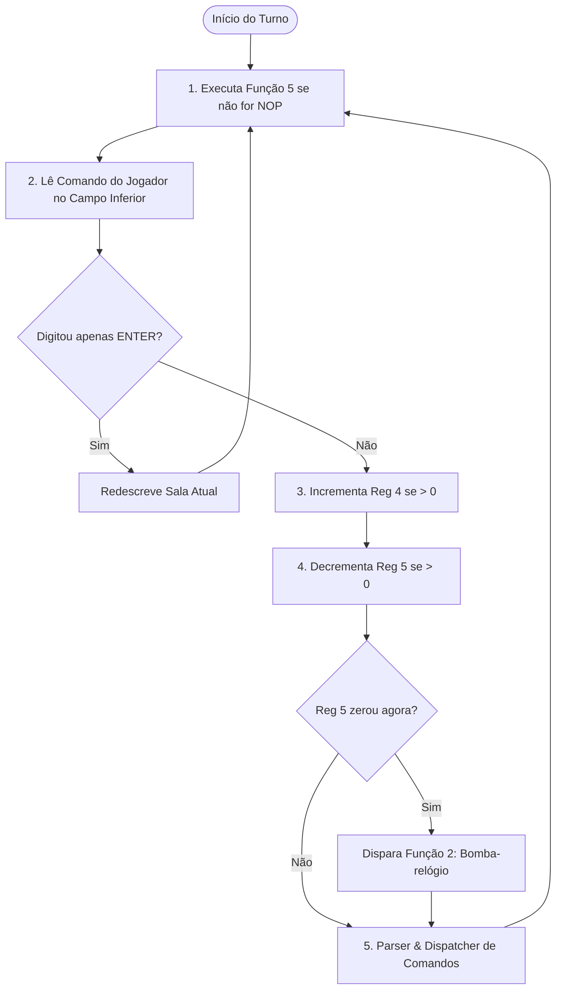

# 📖 Manual do Usuário e Especificação Técnica
## Editor de Adventures — MSX Clean-Room Edition

> **Versão:** 1.0.0  
> **Arquitetura:** Clean-Room baseada no original de **Renato Degiovani** (1986)  
> **Plataforma Alvo:** MSX1 / MSX2 / 2+ / turbo R (32KB ROM em modo texto Screen 0)  
> **Ferramentas de Autoria:** PC (Go 1.20+, TUI Turbo Vision, YAML)

---

## 📑 Índice
1. [Visão Geral e Arquitetura](#1-visão-geral-e-arquitetura)
2. [Estrutura da Tela no MSX (Screen 0)](#2-estrutura-da-tela-no-msx-screen-0)
3. [O Game Loop Oficial](#3-o-game-loop-oficial)
4. [Tabela de Registradores (256 Bytes)](#4-tabela-de-registradores-256-bytes)
5. [Salas e Navegação (Posições)](#5-salas-e-navegação-posições)
6. [Objetos e o Byte de Consistência](#6-objetos-e-o-byte-de-consistência)
7. [Analisador Sintático (Parser)](#7-analisador-sintático-parser)
8. [Tabela Completa de Bytecodes (45 Instruções)](#8-tabela-completa-de-bytecodes-45-instruções)
9. [Formato de História (YAML / JSON)](#9-formato-de-história-yaml--json)
10. [Guia do Editor TUI (edadv.exe)](#10-guia-do-editor-tui-edadvexe)
11. [Guia do Compilador CLI (edadvc.exe)](#11-guia-do-compilador-cli-edadvcexe)
12. [Compilação da ROM para MSX e Emulação](#12-compilação-da-rom-para-msx-e-emulação)
13. [Sistema Avançado de Acentuação e Teclado MSX](#13-sistema-avançado-de-acentuação-e-teclado-msx)
14. [Comandos Especiais do Jogador (Padrão Renato Degiovani 1986)](#14-comandos-especiais-do-jogador-padrão-renato-degiovani-1986)
15. [Documentação Histórica & OCR do Manual Original](#15-documentação-histórica--ocr-do-manual-original)

---

## 1. Visão Geral e Arquitetura

O sistema é dividido em dois componentes independentes e desacoplados:

```
[ História (.yaml) ] 
         │
         ▼
[ Editor TUI / Compilador Go (PC) ]
         │  Gera matrizes estáticas C
         ▼
[ game_data.h / game_data.c ]
         │  Compila com SDCC + MSXgl
         ▼
[ Engine C / Máquina Virtual Z80 ] ──► [ advent.rom (32KB) ] ──► MSX Real / Emulador
```

1. **PC (Go):** Editor visual TUI e compilador que validam regras de consistência, resolvem referências de salas e bytecodes e produzem código C com matrizes de dados compactas.
2. **MSX (C/SDCC/MSXgl):** Engine estática de 32KB em C puro sem dependência de libc pesada, com interpretador de bytecode Z80, parser sintático e driver de vídeo direto do VDP TMS9918.

---

## 2. Estrutura da Tela no MSX (Screen 0)

A engine opera em **Screen 0 (40 colunas × 24 linhas)** com o clássico layout de **3 campos** separados por barras divisórias contínuas:

```
Linha  0: ╔════════════════════════════════════════╗  (Campo Superior: Título do jogo ou
Linha  1: ╠════════════════════════════════════════╣   eco do comando interpretado)
Linhas 2  ║ Você está em um salão escuro.          ║
  a   20: ║ Saídas visíveis: N, L.                 ║  (Campo Central: Descrição de salas,
          ║ Há aqui: UMA VELA, UMA CHAVE.          ║   respostas às ações, inventário;
          ║                                        ║   com rolagem suave e paginação)
Linha 21: ╠════════════════════════════════════════╣
Linhas 22 ║ > PEGUE A VELA                         ║  (Campo Inferior: Prompt de entrada
  e   23: ╚════════════════════════════════════════╝   com edição, maiúsculas e backspace)
```

- **Divisórias:** Renderizadas na inicialização com traços contínuos (`-`) nas linhas 1 e 21.
- **Eco no Campo Superior:** Ao interpretar um comando válido, o campo superior exibe a forma canônica do comando (ex: `PEGUE VELA`), apagando automaticamente a mensagem anterior.
- **Campo Central:** Possui quebra automática de palavras (*word-wrapping*) em 40 colunas e controle de paginação quando o texto excede a linha 20.
- **Campo Inferior:** Prompt de entrada `> ` com cursor interativo, conversão imediata para maiúsculas e tratamento de backspace.

---

## 3. O Game Loop Oficial

O ciclo de execução obedece rigorosamente às etapas descritas no **Capítulo 12 do Manual Original**:



### Ordem de Avaliação do Dispatcher (Passo 5):
1. **Comandos Customizados do Autor:**
   - Procura na tabela de comandos uma entrada compatível com `(Verbo, Objeto1, Objeto2)`.
   - Se encontrar, executa a sequência de bytecodes definida pelo autor.
2. **Movimento Cardeal (Norte, Sul, Leste, Oeste):**
   - Se o comando for uma direção cardeal:
     - `Saída = 0`: Local bloqueado $\rightarrow$ Imprime **Mensagem 15** (*"Você não pode ir nessa direção."*).
     - `1 <= Saída <= 99`: Move o jogador (`Reg 1 = Saída`) e redescreve o ambiente.
     - `Saída > 100`: **Movimento Condicional**. Executa a **Função (`Saída - 100`)**.
3. **Ações Padrão com Objetos (Byte de Consistência):**
   - Se o comando for uma ação padrão (Pegar, Guardar, Trocar, Comprar, Roubar, Tirar, Quebrar), a engine verifica se o objeto possui o respectivo bit habilitado em seu **Byte de Consistência**:
     - Se o bit estiver **ativo (1)**: executa a respectiva **Função de Sistema (6 a 12)**.
     - Se o bit estiver **inativo (0)**: imprime **Mensagem 16** (*"Não é possível fazer isso com este objeto."*).
4. **Comando Desconhecido:**
   - Se nada for reconhecido: imprime **Mensagem 14** (*"Não entendi o que você quer dizer."*).

---

## 4. Tabela de Registradores (256 Bytes)

O estado do mundo é mantido em uma matriz de 256 bytes (`uint8_t registers[256]`):

| Registrador | Mnemônico / Função | Descrição |
|---|---|---|
| `Reg 1` | `POSICAO` | Sala atual do jogador (1 a 99). |
| `Reg 2` | `TURNOS_L` | Contador de jogadas / turnos (Byte Menos Significativo - LSB). |
| `Reg 3` | `TURNOS_H` | Contador de jogadas / turnos (Byte Mais Significativo - MSB). |
| `Reg 4` | `CTR_ESPECIAL` | Contador especial incrementado automaticamente a cada turno (se != 0). |
| `Reg 5` | `BOMBA` | Contador regressivo (bomba-relógio). Ao chegar em 0, dispara a **Função 2**. |
| `Reg 6` | `ESCURO_PASSOS` | Contador de passos no escuro. Ao atingir 5 passos, dispara a **Função 3**. |
| `Reg 7` | `ITENS_OBJ3` | Quantidade de objetos atualmente guardados dentro do Objeto 3. |
| `Reg 8` | `CARGA` | Quantidade de itens carregados na mão pelo jogador (capacidade padrão: 5). |
| `Reg 9` | `FLAG_ESCURO` | Estado de iluminação do local (0 = claro, 1 = escuro). |
| `Reg 10` | `ESTADO_LUZ` | Estado da fonte de luz / Objeto 2 (0 = apagado, 1 = aceso). |
| `Reg 11` | `CLOCK_MIN` | Minutos do relógio interno do jogo. |
| `Reg 12` | `CLOCK_HORA` | Horas do relógio interno do jogo. |
| `Reg 13` | `CLOCK_DIA` | Dias decorridos. |
| `Reg 14` | `CLOCK_DIV` | Divisor de cadência de tempo. |
| `Reg 15..99` | `USUARIO` | Variáveis livres para uso do autor do jogo (puzzles, flags, vidas). |
| `Reg 100+X` | `SITUACAO[X]` | **Acesso direto à situação do Objeto `X`** (`Reg 101` = Obj 1, `Reg 102` = Obj 2, etc.). |

---

## 5. Salas e Navegação (Posições)

Cada sala possui um identificador numérico de `1` a `99`, um nome curto, uma descrição textual e 4 saídas cardeais:

- `Norte` (N)
- `Sul` (S)
### Direções Suportadas (8 Pontos Cardeais e Colaterais):
A engine aceita navegação pelas **8 direções cardeais e colaterais** com suporte a sinônimos em português e abreviações internacionais:
- `Norte` (`N`, `NORTE`)
- `Sul` (`S`, `SUL`)
- `Leste` (`L`, `LESTE`, `E`, `ESTE`)
- `Oeste` (`O`, `OESTE`, `W`, `WEST`)
- `Nordeste` (`NE`, `NORDESTE`)
- `Noroeste` (`NO`, `NOROESTE`, `NW`)
- `Sudeste` (`SE`, `SUDESTE`)
- `Sudoeste` (`SO`, `SUDOESTE`, `SW`)

### Valores Possíveis de Saída:
- `0`: **Bloqueada.** O jogador não pode seguir nessa direção; exibe a **Mensagem 15** (*"Você não pode ir nessa direção."*).
- `1 a 99`: **Saída Direta.** O jogador move-se imediatamente para a sala correspondente (`Reg 1 = Destino`) e o ambiente é redesenhado.
- `> 100`: **Saída Condicional.** Dispara automaticamente a **Função (`Saída - 100`)**.
  - *Exemplo:* Uma saída configurada como `104` executa a **Função 4**, que pode verificar se o jogador possui a chave para abrir a porta antes de alterar `Reg 1`.

---

## 6. Objetos e o Byte de Consistência

Cada objeto do jogo (identificadores `1` a `99`) possui nome, sinônimos, descrição, situação inicial e regras de interação física.

### Objetos Reservados pelo Sistema:
- **Objeto 1 (`LOCAL`):** Palavra reservada usada para examinar o ambiente atual (`OLHE LOCAL` ou `EXAMINE`).
- **Objeto 2 (Fonte de Luz):** Lanterna, vela, tocha ou lampião. Seu estado é refletido no `Reg 10` (0 = apagada, 1 = acesa).
- **Objeto 3 (Recipiente):** Mochila, saco, mala ou baú. Pode conter outros itens do jogo (`Reg 7` controla a quantidade de itens guardados dentro dele).

### Tabela de Situação do Objeto:
| Valor | Significado |
|---|---|
| `0` | Inexistente no mundo ou usado apenas como palavra sintática. |
| `1 a 99` | Presente na respectiva sala (visível no chão ao examinar a sala). |
| `101 a 199` | Presente na sala (`Situação - 100`), porém **oculto** (ex: chave sob o tapete). |
| `250` | **Carregado pelo jogador** (na mão / inventário direto). |
| `251` | Guardado dentro do Objeto 3 **aberto** (acessível para pegar/tirar). |
| `253` | Guardado dentro do Objeto 3 **trancado / fechado** (inacessível). |

### O Byte de Consistência (Flags de Ação Padrão):
O comportamento do objeto frente às ações fundamentais do jogo é determinado por uma máscara de 7 bits:

| Bit | Hex | Ação Permitida | Função Padrão Disparada |
|:---:|:---:|:---|:---|
| `0` | `0x01` | Pode Pegar (*Take*) | **Função 6** (Padrão Pegar) |
| `1` | `0x02` | Pode Guardar no Objeto 3 (*Put in*) | **Função 7** (Padrão Guardar) |
| `2` | `0x04` | Pode Trocar (*Trade*) | **Função 8** (Padrão Trocar) |
| `3` | `0x08` | Pode Comprar (*Buy*) | **Função 9** (Padrão Comprar) |
| `4` | `0x10` | Pode Roubar (*Steal*) | **Função 10** (Padrão Roubar) |
| `5` | `0x20` | Pode Tirar do Objeto 3 (*Remove*) | **Função 11** (Padrão Tirar) |
| `6` | `0x40` | Pode Quebrar (*Break*) | **Função 12** (Padrão Quebrar) |

Se o jogador tentar executar uma ação cujo bit correspondente seja `0`, o jogo responde automaticamente com a **Mensagem 16** (*"Não é possível fazer isso com este objeto."*).

### Regras de Manipulação de Recipientes:
- **`TEMOS` Expandido:** A instrução de máquina virtual `TEMOS` reconhece que o jogador tem o objeto em sua posse tanto se estiver diretamente na mão quanto se estiver guardado dentro da mochila carregada.
- **Tirar Itens:** Objetos guardados no Objeto 3 podem ser retirados com `TIRE <objeto>` (Função 11) ou diretamente com `PEGUE <objeto>` (Função 6 avalia chão e container).
- **Listar Conteúdo:** `EXAMINE MOCHILA` executa a instrução `DLIST` para mostrar tudo que está guardado.
- **Controle de Capacidade:** O `Reg 7` é automaticamente mantido pela VM ao guardar (`POE`), retirar (`PEGA`) ou soltar (`SOLTA`).

---

## 7. Analisador Sintático (Parser) & Tabela de Caracteres Degiovani

O parser da engine processa frases no formato:
$$\text{[VERBO]} + \text{[OBJETO 1]} + \text{[OBJETO 2]}$$

### Características:
1. **Palavras de Ruído Ignoradas:**  
   Artigos e preposições são automaticamente descartados: `O`, `A`, `OS`, `AS`, `UM`, `UMA`, `UNS`, `UMAS`, `DE`, `DO`, `DA`, `DOS`, `DAS`, `NO`, `NA`, `NOS`, `NAS`, `EM`, `COM`, `PARA`, `POR`, `AO`, `AOS`.
2. **Sinônimos por Barra (`/`):**  
   Verbos e objetos podem ter múltiplos sinônimos configurados na história separados por barra (ex: `PEGUE/PEGAR/APANHE`). O parser reconhece qualquer um deles e mapeia para o ID canônico.
3. **Verbos Padrão da Engine (IDs 1 a 40):**
   - **Navegação (1 a 4 e 36 a 39):** `NORTE/N` (1), `SUL/S` (2), `LESTE/L/E/ESTE` (3), `OESTE/O/W/WEST` (4), `NORDESTE/NE` (36), `NOROESTE/NO/NW` (37), `SUDESTE/SE` (38), `SUDOESTE/SO/SW` (39).
   - **Movimento Vertical & Portas:** `ENTRE/ABRA/DESTRANQUE` (7), `SUBA` (8), `SAIA` (9), `DESCA/DESCER` (10).
   - **Sistema & Inventário:** `GRAVE` (5), `RECUPERE` (6), `HORAS` (11), `QUANTO` (12), `TEMOS/INV/I` (13), `RECOMECE/REINICIE` (14), `HA` (15).
   - **Interação Padrão:** `PEGUE` (20), `COLOQUE/PONHA/GUARDE` (21), `TROQUE` (22), `COMPRE` (23), `ROUBE` (24), `TIRE` (25), `QUEBRE` (26), `SOLTE/LARGUE/DEIXE` (27), `EXAMINE/OLHE/VER/EX` (28), `PROCURE/BUSQUE` (29), `OFERECA/DOE/DE` (30), `FACA/ACENDA/RISQUE` (31), `JOGUE/ATIRE` (32), `CONSERTE/REPARE` (33), `VENDA` (34), `BEBA/BEBER/TOME/TOMAR` (35), `ENCHA/ENCHER/ABASTECA` (40).

### Tabela de Caracteres da Fonte Degiovani (Screen 0 / VRAM):
A fonte gráfica original de Renato Degiovani (`vram.dat` / `vram.scr`) possui reorganização de glifos no padrão MSX:
- **Exclamação (`!`):** O código ASCII `0x21` é ocupado pelo caractere `Á`. A exclamação genuína fica no código `0x5B` (caractere `[` padrão). O compilador e o decodificador UTF-8 mapeiam automaticamente `'!'` para `\133` (0x5B).
- **Acentos em Português:** Vogais acentuadas e cedilha são mapeadas para os glifos gráficos do VRAM (`á, é, í, ó, ú, â, ê, ô, ã, õ, ç` e maiúsculas correspondentes). O caractere `õ` minúsculo está alocado em `0xB6` e `Õ` em `0xB5`.
- **Bordas de Tela:** Coluna 2 usa o marcador vertical `0x18`. A divisória superior usa a meia-barra inferior `0x1B`. A divisória inferior usa a meia-barra superior `0x1A`.
- **Debounce de Teclado:** A rotina de entrada do MSX (`UI_ReadLine`) lê a matriz de teclado `NEWKEY` nas linhas 0 a 8 e aguarda ativamente a liberação física da tecla antes de processar o próximo caractere, eliminando duplicatas e repetições involuntárias.

---

## 8. Tabela Completa de Bytecodes (45 Instruções)

A máquina virtual implementada em [engine/src/interpreter.c](file:///e:/editadv/engine/src/interpreter.c) suporta todas as **45 instruções** especificadas no Capítulo 8 do manual original:

| Código | Mnemônico | Operandos | Operação |
|:---:|:---|:---|:---|
| `0` | `NOP` | — | Nenhuma operação. |
| `1` | `MSG` | `id` | Imprime a Mensagem número `id`. |
| `2` | `NVC` | `arg` | Nova linha / avanço no campo central. |
| `3` | `LLIST` | — | Lista as saídas visíveis da sala atual. |
| `4` | `CLIST` | — | Lista os objetos presentes na sala atual. |
| `5` | `DLIST` | — | Lista o inventário carregado pelo jogador. |
| `6` | `OBJ` | `id` | Imprime o nome do Objeto número `id`. |
| `7` | `INC` | `reg` | Incrementa o registrador `Reg[reg] = Reg[reg] + 1`. |
| `8` | `DEC` | `reg` | Decrementa o registrador `Reg[reg] = Reg[reg] - 1`. |
| `9` | `LDR` | `reg, val` | Atribui valor imediato ao registrador: `Reg[reg] = val`. |
| `10` | `SOMA` | `reg1, reg2` | Soma de registradores: `Reg[reg1] += Reg[reg2]`. |
| `11` | `RND` | `reg, max` | Gera número aleatório entre 1 e `max` em `Reg[reg]`. |
| `12` | `REG=` | `reg, val, dest` | Se `Reg[reg] == val`, desvia para o label `dest`. |
| `13` | `REG>` | `reg, val, dest` | Se `Reg[reg] > val`, desvia para o label `dest`. |
| `14` | `REG<` | `reg, val, dest` | Se `Reg[reg] < val`, desvia para o label `dest`. |
| `15` | `AQUI` | `obj, dest` | Se `Obj[obj]` está na sala atual, desvia para `dest`. |
| `16` | `LOCAL` | `pos, dest` | Se o jogador está na sala `pos`, desvia para `dest`. |
| `17` | `TEMOS` | `obj, dest` | Se o jogador está carregando `Obj[obj]`, desvia para `dest`. |
| `18` | `SOLTA` | `obj` | Larga o objeto no chão da sala atual (`Sit = Reg[1]`). |
| `19` | `PEGA` | `obj` | Coloca o objeto no inventário do jogador (`Sit = 250`). |
| `20` | `CRIA` | `obj, pos` | Coloca o objeto na posição informada (`Sit = pos`). |
| `21` | `APAG` | `obj` | Remove o objeto do mundo (`Sit = 0`). |
| `22` | `GOSUB` | `func_id` | Chama uma sub-rotina / Função número `func_id`. |
| `23` | `LIBR` | `reg` | Zera o registrador: `Reg[reg] = 0`. |
| `24` | `TRC` | `obj1, obj2` | Troca a situação dos dois objetos entre si. |
| `25` | `POE` | `obj` | Guarda o objeto dentro do Objeto 3 (`Sit = 251`). |
| `26` | `ESV` | — | Esvazia o Objeto 3, jogando todos os itens no chão. |
| `27` | `OK` | — | Imprime mensagem de confirmação padrão (*"OK."*). |
| `28` | `REGN` | `r1, r2, dest` | Se `Reg[r1] != Reg[r2]`, desvia para `dest`. |
| `29` | `NVF` | — | Avança tela / paginação no campo central. |
| `30` | `REF` | — | Redescreve o ambiente atual e seus objetos. |
| `31` | `FIM` | — | Encerra a execução da rotina atual. |
| `32` | `NEU` | — | Instrução nula / neutra. |
| `33` | `DESC` | `pos` | Imprime a descrição da sala número `pos`. |
| `34` | `RET` | — | Retorna da sub-rotina chamada por `GOSUB`. |
| `35` | `GOTO` | `dest` | Desvio incondicional para o label `dest`. |
| `36` | `PAUSA`| `frames` | Pausa a execução por número de quadros de vídeo (V-Blank). |
| `37` | `FLAG` | `reg, bit, dst`| Se o bit do registrador estiver ativo, desvia para `dst`. |
| `38` | `EVID` | `obj, sit, dst`| Se a situação de `obj == sit`, desvia para `dst`. |
| `39` | `CLS` | — | Limpa o campo central da tela. |
| `40` | `EVD=` | `o1, o2, dest` | Se as situações de `o1` e `o2` forem iguais, desvia. |
| `41` | `CHRS` | `code` | Imprime caractere pelo código ASCII. |
| `42` | `PRT` | `reg` | Imprime o valor numérico contido no registrador. |
| `43` | `DNT` | `obj, dest` | Se `obj` está dentro do Objeto 3, desvia para `dest`. |
| `44` | `CMD` | — | Força o reprocessamento de um novo comando. |

---

## 9. Formato de História (YAML / JSON)

As histórias são escritas em arquivos modernos estruturados (como [games/demo.yaml](file:///e:/editadv/games/demo.yaml)).

### Exemplo Mínimo:

```yaml
title: "A Caverna Perdida"
author: "Seu Nome"
version: "1.0.0"
start_room: 1
prompt: "> "

rooms:
  - id: 1
    name: "Entrada da Caverna"
    description: "Você está diante de uma abertura sombria na rocha."
    exits:
      north: 2   # Vai para sala 2
      south: 0   # Bloqueado
      east: 104  # Saída condicional: executa Função 4
      west: 0

objects:
  - id: 2
    name: "TOCHA"
    synonyms: "TOCHA/LANTERNA/FOGO"
    description: "Uma tocha feita de madeira e resina."
    initial_room: 1
    consistency:
      take: true         # Bit 0: Pode pegar
      store_in_obj3: true # Bit 1: Pode guardar na mochila
      break: true        # Bit 6: Pode quebrar

commands:
  - verb: "ACENDER"
    obj1: "TOCHA"
    obj2: ""
    instructions:
      - op: "LDR"
        args: [10, 1]    # Reg 10 = 1 (Luz acesa)
      - op: "MSG"
        args: [23]       # "A tocha se acende com uma chama brilhante!"
      - op: "FIM"

functions:
  - id: 4  # Portão trancado (saída 104)
    instructions:
      - op: "TEMOS"
        args: [5, "tem_chave"] # Verifica se tem Obj 5
      - op: "MSG"
        args: [24]             # "O portão de ferro está trancado."
      - op: "FIM"
      - label: "tem_chave"
      - op: "MSG"
        args: [25]             # "Você destranca o portão com a chave de ferro!"
      - op: "LDR"
        args: [1, 3]           # Move para sala 3
      - op: "REF"              # Redescreve
      - op: "FIM"

messages:
  - id: 23
    text: "A tocha se acende com uma chama brilhante!"
  - id: 24
    text: "O portão de ferro está trancado com um cadeado antigo."
  - id: 25
    text: "Você destranca o portão com a chave de ferro!"
```

---

## 10. Guia do Editor TUI (`edadv.exe`)

O editor visual fornece uma interface em modo texto (*Turbo Vision*) para criação e teste sem precisar tocar em código:

```
┌─── Editor de Adventures - MSX Edition (demo.yaml) ──────────────────────────┐
│ [1] Salas & Mapa  [2] Objetos  [3] Comandos  [4] Mensagens  [5] Compilar    │
├─────────────────────────────────────────────────────────────────────────────┤
│ ID │ Nome da Sala          │ N  │ S  │ L  │ O  │   Rosa dos Ventos          │
│  1 │ Entrada da Mansão     │  2 │  0 │  3 │  0 │         [N: 2]             │
│  2 │ Salão Principal       │  0 │  1 │  4 │  0 │           │                │
│  3 │ Biblioteca Velha      │  0 │  0 │  0 │  1 │   [O: 0]──┼──[L: 3]        │
│  4 │ Porão Sombrio         │  0 │  0 │  0 │  2 │           │                │
│                                                │         [S: 0]             │
└─────────────────────────────────────────────────────────────────────────────┘
  F1 Ajuda │ F2 Salvar │ F5 Compilar C │ F9 Gerar ROM │ F10 Sair
```

### Abas de Trabalho:
1. **[1] Salas & Mapa:**
   - Lista todas as salas com suas saídas.
   - Painel lateral com **Rosa dos Ventos interativa** renderizada em ASCII mostrando as conexões da sala selecionada.
2. **[2] Objetos:**
   - Edição de nome, sinônimos, descrição e situação inicial.
   - Painel de **Flags de Consistência** com caixas de seleção interativas para os 7 bits de ações padrão.
3. **[3] Comandos & Funções:**
   - Editor de comandos customizados e funções de sistema.
   - **Painel Didático de Bytecodes:** ao navegar pelas instruções, exibe a explicação em linguagem natural do que aquele opcode realiza.
4. **[4] Mensagens:**
   - Edição de mensagens do sistema (11 a 22) e mensagens autorais.
5. **[5] Compilar & Build:**
   - Dispara a compilação para C (`F5`) e a geração da ROM de MSX (`F9`), com console de log em tempo real integrado.

### Teclas de Atalho Principais:
- `1` a `5`: Alternar rapidamente entre abas.
- `Tab` / `Shift+Tab`: Mover o foco entre listas e painéis de detalhes.
- `F1`: Janela de ajuda contextual.
- `F2`: Salvar alterações no arquivo YAML.
- `F5`: Exportar matrizes C (`game_data.h` / `game_data.c`).
- `F9`: Compilar a ROM (`advent.rom`) chamando o MSXgl.
- `F10` ou `Ctrl+C`: Encerrar o editor.

---

## 11. Guia do Compilador CLI (`edadvc.exe`)

Para integração contínua ou automações via terminal/scripts:

```bash
# Compilar história YAML para matrizes C no diretório atual
edadvc -i games/demo.yaml -o engine/src/

# Especificar caminho de saída customizado
edadvc -i historia.yaml -o ./meu_projeto/src/
```

O compilador verifica:
- Validade de todos os identificadores de salas e objetos;
- Resolução de labels e cálculo automático de endereços de desvio (PC relativo/absoluto);
- Cálculo do Byte de Consistência para cada objeto;
- Geração dos cabeçalhos `game_data.h` e das tabelas estáticas em `game_data.c`.

---

## 12. Compilação da ROM para MSX e Emulação

### Compilando em 1 Clique (Windows):
Na raiz do projeto, execute:
```cmd
build.bat
```
*(ou `powershell -ExecutionPolicy Bypass -File build.ps1`)*

O script:
1. Verifica o ambiente Go e baixa dependências automaticamente;
2. Compila os executáveis `edadv.exe` e `edadvc.exe`;
3. Compila a ROM de 32KB (`advent.rom`) através do SDCC e MSXgl;
4. Cria o pacote pronto em `dist/`.

### Executando em Emuladores:

#### 1. openMSX
```bash
openmsx -machine MSX1 -cart MSXgl/projects/advent/out/advent.rom
```

#### 2. WebMSX (Navegador sem instalação)
1. Acesse [webmsx.org](https://webmsx.org/).
2. Arraste e solte o arquivo `advent.rom` dentro da janela do navegador.

#### 3. BlueMSX
1. Abra o BlueMSX.
2. Menu **Arquivo** $\rightarrow$ **Cartucho Slot 1** $\rightarrow$ **Inserir...**
3. Selecione `advent.rom`.

#### 4. Hardware Real (MSX1, MSX2, MSX2+, MSX turbo R)
- Copie `advent.rom` para cartuchos regraváveis como Carnivore2, MegaFlashROM SCC+, Rookie Drive ou MFR.

---

## 13. Sistema Avançado de Acentuação e Teclado MSX

O sistema implementa uma solução ergonômica e autêntica para o suporte a acentos no padrão MSX (Screen 0, 40 colunas), permitindo que o jogador digite caracteres da língua portuguesa com rapidez e conforto.

### As 13 Letras Acentuadas
A engine dá suporte a todo o conjunto essencial da língua portuguesa em letras maiúsculas:
$$\text{À, Á, Â, Ã, Ç, É, Ê, Í, Ó, Ô, Õ, Ú, Ü}$$

*O caractere `Ü` maiúsculo recebeu um glifo personalizado desenhado em VRAM (código `0x9F`), substituindo o caractere de libra esterlina da ROM padrão do MSX.*

### 1. Inserção Rápida: Tecla [TAB]
A qualquer momento durante a digitação de um comando, pressionar **[TAB]** abre uma janela de diálogo clássica centralizada na tela:
- **Moldura Gráfica IBM-PC / MSX:** Desenhada com caracteres semigráficos (`0x81`, `0x9A`, `0xA6`, `0xA7`, `0x5F`, `0x5E`), proporcionando o visual limpo dos utilitários dos anos 1990.
- **Ordem Alfabética Estrita:** As 13 letras são dispostas em uma grade de 5 colunas perfeitamente alinhadas:
  ```text
  À      Á      Â      Ã      Ç
  É      Ê      Í      Ó      Ô
  Õ      Ú      Ü
  ```
- **Navegação Interativa:** O jogador move o cursor entre as letras usando as **setas direcionais** ($\leftarrow, \rightarrow, \uparrow, \downarrow$). O cursor é indicado visualmente por colchetes (ex: `[Á]`).
- **Confirmação:** Pressionar **ENTER** insere o caractere escolhido na linha de comando e fecha a janela. Pressionar **ESC** cancela.

### 2. Configuração de Atalhos: Tecla [SELECT]
Para digitar sem abrir menus, o jogador dispõe de 10 atalhos instantâneos: **Shift+1** até **Shift+9** e **Shift+0**.

Pressionar **[SELECT]** abre a tela de configuração personalizada em dois níveis:
1. **Fase 1 (Quadro Inferior - Atalhos):**
   - O cursor percorre os 10 atalhos existentes (ex: `[1:Á]`, `[2:É]`, etc.).
   - O jogador navega com as setas até o atalho que deseja reconfigurar e pressiona **ENTER** (ou digita diretamente o número `1` a `0`).
2. **Fase 2 (Quadro Superior - Tabela de Acentos):**
   - O atalho escolhido permanece realçado como `>1:Á<` e o foco passa para a grade de acentos.
   - O jogador navega com as setas até a nova letra desejada e pressiona **ENTER**.
   - A alteração tem efeito imediato durante a partida.
   - Pressionar **ESC** retorna ao jogo.

### 3. Otimização Inteligente pelo Compilador
Ao compilar a história (`.yaml`), o compilador Go analisa estatisticamente a frequência de cada letra acentuada no vocabulário e textos do jogo. Os 10 atalhos padrão de fábrica já vêm pré-configurados com os acentos mais usados daquela aventura específica.

---

## 14. Comandos Especiais do Jogador (Padrão Renato Degiovani 1986)

Além dos comandos narrativos do mundo (`PEGUE`, `SOLTE`, `EXAMINE`, etc.), a engine reconhece comandos canônicos de suporte ao jogador:

- **`VERBO` ou `VERBOS`:** Lista na tela todos os verbos compreendidos pelo analisador sintático do jogo atual, auxiliando o jogador a entender o escopo de ações possíveis.
- **`INSTRUCAO` ou `INSTRUCOES`:** Reexibe a tela inicial com as regras gerais do jogo e convenções de movimentação.
- **`DICA` ou `DICAS`:** Fornece orientações ou pistas contextuais preparadas pelo autor do adventure para destravar situações de empasse.

---

## 15. Documentação Histórica & OCR do Manual Original

Para pesquisadores, desenvolvedores e entusiastas da história da informática brasileira, o manual original de 1986 (*"Sistema Editor de Adventures Versão 3.4"* por Renato Degiovani) foi integralmente transcrito e digitalizado via OCR, preservando todas as seções técnicas, registradores e o jogo de exemplo *MANSÃO*.

Consulte o documento completo em:
📄 **[docs/editor_adventure.md](docs/editor_adventure.md)**

